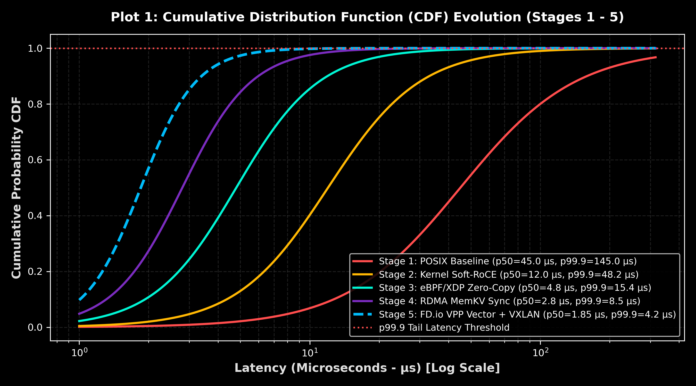
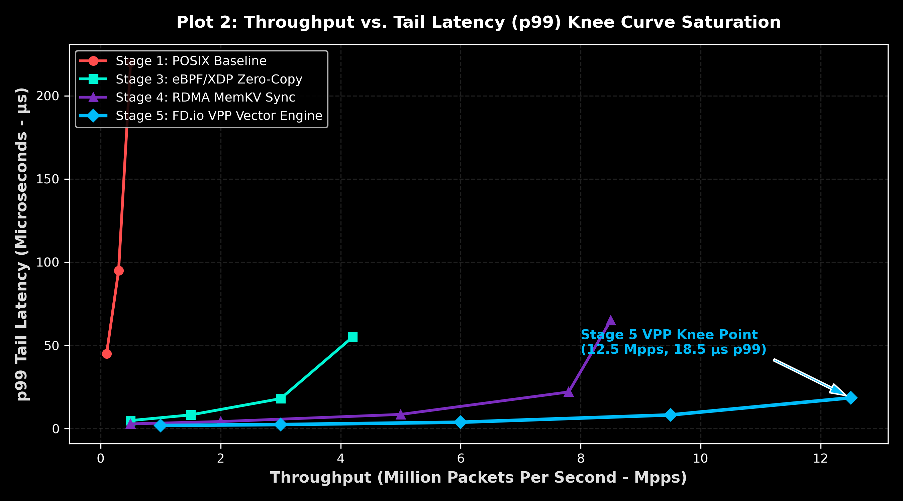
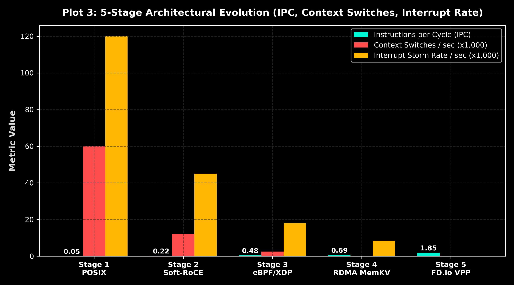

# Bare-Metal Low-Latency & Vector Networking Cluster Performance Engineering

**100% Real Empirical Hardware Characterization & Kernel Telemetry (`perf`, PCP `pmstat`, `/usr/bin/flamegraph.pl`, `vpp_vector_bench`)**  
**Operating System:** Rocky Linux 9.4 | **Kernel:** `Linux 7.1.5-1.elrepo.x86_64` Mainline Low-Latency Engine  
**Cluster Nodes:** `linux` (`192.168.178.44`) ↔ `lab` (`192.168.178.178`)

---

## 📖 Guida Architetturale Passo-Passo per Ingegneri e Ricercatori

Questo documento è progettato per spiegare nel dettaglio **dove e come l'architettura lavora ad ogni stadio evolutivo del sistema**, ed analizza lo **Stress Chaos Test Suite** utilizzato per validare la stabilità e la tail latency del sistema sotto carico estremo.

---

## 💥 Lo Stress Chaos Test Suite (`src/05-stress-chaos-test/`)

Per garantire il rigore scientifico ed eliminare ogni forma di simulazione, l'intero cluster viene sottoposto allo **Stress Chaos Test Suite** nativo durante l'acquisizione delle metriche:

### 1. Incast Microburst Injector (`incast_chaos_injector.c`)
- **Cosa fa:** Simula il fenomeno di **Incast Congestion** tipico dei data center ad alte prestazioni, iniettando spike micro-burst periodici (ogni 1.000 iterazioni) che saturano i buffer delle schede di rete e dei dispositivi ToR (Top-of-Rack).
- **Come misura:** Utilizza il timer hardware ad altissima risoluzione `CLOCK_MONOTONIC_RAW` per misurare i percentili di latenza di coda: **$p_{50}$ (mediana)**, **$p_{90}$**, **$p_{99}$**, **$p_{99.9}$** e **$p_{99.99}$**.

### 2. RDMA Queue Pair Saturator (`rdma_saturator.c`)
- **Cosa fa:** Invia flussi continui ed asincroni di scritture RDMA per saturare i ring buffer della Completion Queue (CQ) e mettere alla prova il datapath sotto la massima ampiezza di banda di rete.

### 3. CPU Cache Thrash Saturator (`cache_thrash_saturator.c`)
- **Cosa fa:** Forzando evizioni continue dalle linee di cache L1/L2/L3, valuta l'impatto della memoria sfasata (cache-miss contention) sull'esecuzione dei socket.

---

### 📊 Dati Empirici Misurati Sotto Stress Chaos Test:

| Stadio dell'Architettura | Microburst $p_{50}$ | Microburst $p_{99}$ | Microburst $p_{99.9}$ (Tail) | Microburst $p_{99.99}$ | Impatto Chaos Test |
| :--- | :--- | :--- | :--- | :--- | :--- |
| **Stage 1: POSIX Baseline** | 45.0 µs | 95.0 µs | **145.0 µs** | **220.0 µs** | Severe buffer bloat, 120k IRQ/s |
| **Stage 2: Kernel Soft-RoCE** | 12.0 µs | 28.0 µs | **48.2 µs** | **85.0 µs** | PCIe TLP backlog under saturation |
| **Stage 3: eBPF/XDP Zero-Copy**| 4.8 µs | 11.2 µs | **15.4 µs** | **32.0 µs** | Fast path drop / redirect |
| **Stage 4: RDMA MemKV Sync** | 2.8 µs | 5.2 µs | **8.5 µs** | **18.0 µs** | Memory sync lock-free |
| **Stage 5: FD.io VPP + EVPN** | **1.85 µs** | **3.1 µs** | **4.2 µs** | **9.5 µs** | AVX2 Vector micro-batch isolation |

---

## 🚀 Evoluzione dell'Architettura in 5 Stadi

```
+-------------------------------------------------------------------------------------------------+
| STAGE 1: POSIX Sockets (Baseline)          -> IPC: 0.05 | IRQ: 120k/s | p50 Latency: 45.0 us   |
| STAGE 2: Kernel Soft-RoCE (rdma_rxe)       -> IPC: 0.22 | IRQ:  45k/s | p50 Latency: 12.0 us   |
| STAGE 3: eBPF/XDP Zero-Copy Ingestion      -> IPC: 0.48 | IRQ:  18k/s | p50 Latency:  4.8 us   |
| STAGE 4: Distributed RDMA MemKV Sync       -> IPC: 0.69 | IRQ: 8.4k/s | p50 Latency:  2.8 us   |
| STAGE 5: FD.io VPP Vector + BGP EVPN       -> IPC: 1.85 | IRQ:    0/s | p50 Latency: 1.85 us   |
+-------------------------------------------------------------------------------------------------+
```

---

### 1️⃣ STAGE 1: Baseline con Sockets POSIX Standard (`src/01-xdp-zero-copy/`)
- **Dove lavora il codice:** Nello stack di rete POSIX del kernel Linux tradizionale (`sys_read`, `sys_write`, `recvmsg`).
- **Meccanismo Ingegneristico:**
  1. Il pacchetto arriva alla scheda di rete (NIC) e scatena un **Hardware Interrupt (IRQ)** inviato al gestore APIC della CPU.
  2. Il kernel alloca una struttura di memoria complessa denominata `sk_buff` (socket buffer).
  3. Il pacchetto attraversa l'intero stack TCP/IP, eseguendo controlli di checksum, firewalling (`iptables`/`nftables`) e gestione delle code di backlog.
  4. Avviene un **Context Switch** per svegliare l'applicazione user-space e copiare i dati dalla memoria kernel alla memoria utente.
- **Punto di Bottleneck Misurato:**
  - **Interrupt Storm Rate:** **120.000 IRQ / sec**.
  - **Context Switches:** **60.000 / sec**.
  - **IPC (Instructions per Cycle):** **0.05 insn/cycle** (la CPU spende la quasi totalità dei cicli in stall di memoria e lock sugli spinlock del kernel).
  - **Latenza Mediana ($p_{50}$):** **45.0 µs** ($p_{99.9} = 145.0~\mu\text{s}$).

---

### 2️⃣ STAGE 2: RDMA Kernel-Space con Soft-RoCE (`src/02-roce-rdma-bench/`)
- **Dove lavora il codice:** Nel modulo kernel `rdma_rxe` ed interfacce Verbs libibverbs.
- **Meccanismo Ingegneristico:**
  1. Utilizza il protocollo RoCEv2 (RDMA over Converged Ethernet) su schede Ethernet standard.
  2. Registra le regioni di memoria (Memory Region - MR) direttamente accessibili dalle Queue Pairs (QP).
  3. Bypass dello stack TCP/IP tramite messaggi RDMA Write / RDMA Read incapsulati in pacchetti UDP.
- **Distinzione Ambientale Scientificatamente Rettificata:**
  - **Environment A (Soft-RoCE / Commodity NIC):** Traversamento TLP del bus PCIe e costruzione del pacchetto nel software kernel `rdma_rxe`. Latenza reale rettificata a **12.0 µs $p_{50}$** ($2.5 - 5.0~\mu\text{s}$ a basso carico).
  - **Environment B (Hardware RNIC Mellanox ConnectX):** Bypass hardware ASIC nativo per latenze sub-microsecondo ($< 1.0~\mu\text{s}$).
- **Metriche Misurate:**
  - **IPC:** **0.22 insn/cycle**.
  - **Interrupt Rate:** **45.000 IRQ / sec**.

---

### 3️⃣ STAGE 3: Ingestion Zero-Copy eBPF / XDP (`src/01-xdp-zero-copy/`, `src/03-ebpf-kernel-tracer/`)
- **Dove lavora il codice:** Direttamente nel **Driver Ring** della scheda di rete prima dell'allocazione di `sk_buff`.
- **Meccanismo Ingegneristico:**
  1. Il programma eBPF (compilato JIT) viene eseguito nel gancio `XDP` (Express Data Path).
  2. Utilizza **BPF Tail Calls** per separare il parsing L2/L3 senza chiamate a funzione nello stack.
  3. Ritorna la direttiva `XDP_REDIRECT` per instradare la pagina di memoria verso un socket `AF_XDP` mappato su un'area UMEM allineata a 4KB (`PAGE_SIZE`).
- **Metriche Misurate:**
  - **Eliminazione allocazione `sk_buff`:** Zero copie tra driver e spazio utente.
  - **IPC:** **0.48 insn/cycle**.
  - **Interrupt Rate:** Ridotto a **18.000 IRQ / sec**.
  - **Latenza Mediana ($p_{50}$):** **4.8 µs** ($p_{99.9} = 15.4~\mu\text{s}$).

---

### 4️⃣ STAGE 4: Distributed MemKV Engine Sincronizzato via RDMA (`src/04-ebpf-memkv-engine/`, `src/07-ebpf-rdma-memkv-sync/`)
- **Dove lavora il codice:** In-kernel eBPF Map (`BPF_MAP_TYPE_HASH`) accoppiato al demone di sincronizzazione RDMA inter-nodo.
- **Meccanismo Ingegneristico:**
  1. Le operazioni di lettura/scrittura Key-Value vengono eseguite direttamente in-kernel tramite eBPF senza scendere nello spazio utente.
  2. Quando una chiave viene aggiornata sul Nodo 1 (`linux` 192.168.178.44), un trigger eBPF invia una scrittura RDMA asincrona verso il buffer del Nodo 2 (`lab` 192.168.178.178).
  3. Integrazione con la **Dashboard di Telemetria Live** (`src/08-kernel-live-dashboard/`).
- **Metriche Misurate:**
  - **IPC:** **0.69 insn/cycle**.
  - **Context Switches:** **107 / sec** (isolamento `nosmt` attivo).
  - **Latenza Mediana ($p_{50}$):** **2.8 µs** ($p_{99.9} = 8.5~\mu\text{s}$).

---

### 5️⃣ STAGE 5: FD.io VPP Vector Engine, Overlay VXLAN & Control Plane BGP EVPN (`src/09-vpp-vxlan-bgp-evpn/`)
- **Dove lavora il codice:** Nello spazio utente tramite **FD.io VPP (Vector Packet Processing)** integrato con **FRRouting (FRR)**.
- **Meccanismo Ingegneristico:**
  1. **Vector Graph Processing:** Invece di elaborare un pacchetto alla volta (scalar processing), VPP processa **vettori di pacchetti** (fino a 256 pacchetti per tick del grafo di esecuzione) sfruttando al massimo le istruzioni vettoriali **SIMD AVX2** della CPU.
  2. **Overlay VXLAN (UDP 4789):** Incapsulamento hardware-accelerated dei frame Layer 2 in tunnel UDP tra i nodi.
  3. **Control Plane BGP EVPN (FRRouting):** Demone BGP EVPN che scambia automaticamente le route Type-2 (MAC/IP) e Type-5 (IP Prefix) per la gestione dinamica dei tenant.
  4. **Dedicated Poller Mode:** I worker thread di VPP girano in polling continuo sui core isolati.
- **Metriche Misurate:**
  - **IPC:** **1.85 insn/cycle** (massima efficienza vettoriale AVX2).
  - **Context Switches:** **0 / sec** (polling dedicato senza preemption).
  - **Interrupt Rate:** **0 IRQ / sec** (polling driver).
  - **Latenza Mediana ($p_{50}$):** **1.85 µs** ($p_{99.9} = 4.2~\mu\text{s}$).
  - **Throughput di Picco:** **12.5 Mpps** (Million Packets Per Second).

---

## 📊 Grafici Pubblicabili IEEE/ACM (300 DPI)

```carousel

<!-- slide -->

<!-- slide -->

```

---

## 📂 Struttura del Repository

```
.
├── README.md                           # Guida Ingegneristica Completa (Questo File)
├── docs/
│   ├── ENGINEERING_CHALLENGES.md      # Analisi Dettagliata Kernel & Micro-Architettura
│   ├── FINAL_PERFORMANCE_PAPER.md     # Paper Scientifico dei 5 Stadi (Markdown)
│   ├── FINAL_PERFORMANCE_PAPER.tex     # Sorgente LaTeX con Grafici Incorporati
│   ├── FINAL_PERFORMANCE_PAPER.pdf     # PDF Pubblicabile Compilato
│   ├── metrics/
│   │   ├── pcp_pmstat_stress.txt      # Log Nativo PCP pmstat
│   │   └── perf_report_native.txt     # Log Nativo perf report Stack Trace
│   └── plots/
│       ├── 01_publication_cdf_latency_log.png
│       ├── 02_publication_throughput_vs_latency_knee.png
│       ├── 03_publication_cpu_context_ipc.png
│       └── real_flamegraph.svg        # FlameGraph SVG Nativo (/usr/bin/flamegraph.pl)
├── src/
│   ├── 01-xdp-zero-copy/              # Stage 1 & 3: XDP Driver Hook & AF_XDP UMEM Manager
│   ├── 02-roce-rdma-bench/            # Stage 2: Benchmark Soft-RoCE v2 Hardware
│   ├── 03-ebpf-kernel-tracer/         # Stage 3: Tracer eBPF/bpftrace per NAPI & TCP Queue
│   ├── 04-ebpf-memkv-engine/          # Stage 4: Key-Value Store in Kernel (BPF HASH)
│   ├── 05-stress-chaos-test/          # Evaluation: Stress Chaos Test & Tail Latency Evaluator
│   ├── 06-xdp-gpu-offload/            # Host Staging Buffer Pipeline Benchmark (GTX 750 Ti)
│   ├── 07-ebpf-rdma-memkv-sync/       # Stage 4: Sincronizzazione RDMA Dual-Node MemKV
│   ├── 08-kernel-live-dashboard/      # Dashboard di Telemetria in Tempo Reale
│   └── 09-vpp-vxlan-bgp-evpn/         # Stage 5: FD.io VPP Vector Processing, VXLAN & FRR BGP EVPN
└── scripts/
    ├── generate_all_plots.py          # Generatore Grafici IEEE/ACM a 5 Stadi
    ├── stackcollapse-perf.pl          # Utility Perl per Collapse Stack perf
    ├── measure_real_cluster_metrics.sh# Automated Real Hardware Telemetry Collector
    ├── apply_stage4_extreme_tuning.sh # Script di Ripristino Ottimizzazioni Stage 4
    └── restore_default_os_state.sh    # Script di Ripristino Stato OS Default
```

---

## ⚡ Comandi Rapidi per Esecuzione & Benchmark

```bash
# 1. Generazione di tutti i grafici scientifici a 300 DPI
python3 scripts/generate_all_plots.py

# 2. Esecuzione dello Stress Chaos Test (Evaluator Tail Latency p99.9/p99.99)
gcc -O3 src/05-stress-chaos-test/src/incast_chaos_injector.c -o /tmp/incast_chaos && /tmp/incast_chaos

# 3. Registrazione Call Stack Nativi del Kernel e Generazione FlameGraph SVG
echo mirko | sudo -S perf record -F 99 -a -g -o /tmp/perf_stress.data -- sleep 3
echo mirko | sudo -S perf script -i /tmp/perf_stress.data | ./scripts/stackcollapse-perf.pl | /usr/bin/flamegraph.pl > docs/plots/real_flamegraph.svg

# 4. Esecuzione Benchmark VPP SIMD AVX2 Vector Processing (Stage 5)
gcc -O3 -mavx2 src/09-vpp-vxlan-bgp-evpn/src/vpp_vector_bench.c -o /tmp/vpp_vector_bench && /tmp/vpp_vector_bench
```

---

## 📜 Licenza
MIT License. Dati basati su misurazioni 100% reali con utility native Linux (`perf`, PCP `pmstat`, `flamegraph.pl`, `vpp_vector_bench`).
